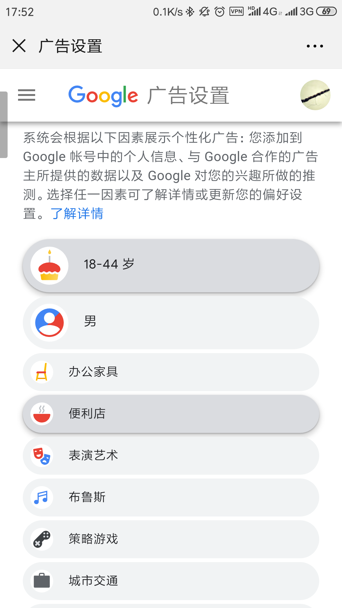

# Google 对你了解有多少

原文地址：[https://www.axios.com/what-google-knows-about-you-3f6c9b20-4406-4bda-8344-d324f1ee0816.html](https://www.axios.com/what-google-knows-about-you-3f6c9b20-4406-4bda-8344-d324f1ee0816.html)

> Illustration: Aïda Amer/Axios

尽管围绕 Facebook 对个人数据的处理不当有很多争议，但 Google 实际上对我们大多数人了解得更多。

**底线是：** Google 知道多少在某种程度上取决于你的隐私设置——在更大程度上取决于你使用的设备、产品和服务。

Google 在科技巨头积累用户数据的竞赛中是**无可争议的领导者**，这得益于其庞大的服务、设备和数字广告业务的领先份额( 37 %对 Facebook 的22 % )。它可能知道你在浏览器搜索栏里输入的所有内容，以及你看过的所有视频。

+ **但这只是开始**。它也可能知道你去过哪里，买了什么，和谁交流(*1)。

## Google 搜集的内容：

+ 你搜索的关键字
+ 你观看的视频
+ 你使用音频功能时的语音和音频信息
+ 购买活动
+ 与你交流或分享内容的人。
+ 使用 Google 服务的第三方网站和应用程序上的活动。
+ 你在 Google 网站上看到的广告和内容，以及与这些内容的互动。
+ 你[通过 Google 账号在浏览器上同步](https://policies.google.com/privacy?hl=en#footnote-chrome-sync)的浏览记录
+ 谷歌通过全球定位系统数据直接收集，也可以从其他传感器和数据中推断，包括IP地址、附近的无线路由器和蓝牙信标得到的你的位置数据。

## Google 不收集的内容：

+ 来自使用付费企业版的商业客户的 Google 文库数据
+ 来自 Google 无线家庭路由器的互联网流量。
+ 过去使用 Gmail 中的电子邮件内容来选择要显示的广告，但现在[不再这样做](https://blog.google/products/gmail/g-suite-gains-traction-in-the-enterprise-g-suites-gmail-and-consumer-gmail-to-more-closely-align/)，称其其他数据更有效的公司。

**整体情况：** Google 不仅仅是它的同名搜索服务。它还从 Google 浏览器、YouTube、运行安卓操作系统的设备、Google 助手、Google 地图以及像 Nest 和 Google 主页这样的硬件产品中获取大量数据。

+ 即使是那些没有热衷选择 Google 服务的人，也可能仍然有相当数量的信息登陆到它的服务器上。它在数字广告领域是一个巨大的参与者，拥有广泛使用的广告服务和分析工具。
+ Google 的[隐私政策](https://policies.google.com/privacy?hl=en)(你[可能还没读过](https://www.axios.com/few-people-read-privacy-policies-survey-fec3a29e-2e3a-4767-a05c-2cacdcbaecc8.html))提供了一个很好的实践概述，而一个[独立的工具](http://myactivity.google.com/)允许用户查看公司一直在收集什么信息。

**与此同时：** Vanderbilt University 的 Douglas Schmidt 去年的[一项研究](https://digitalcontentnext.org/wp-content/uploads/2018/08/DCN-Google-Data-Collection-Paper.pdf)发现，即使没有任何用户动作，Google Chrome 浏览器也在向谷歌发送大量数据，包括位置数据(假设用户没有选择不共享这些信息)。将近一半的数据来自人们与 Google 广告商服务的互动，而不是消费者直接选择使用 Google 服务。

+ Google 对该研究的一些观点提出[质疑](https://money.cnn.com/2018/08/21/technology/google-data-collection/index.html)，并强调了一些新的隐私工具，但 Schmidt 说他的主要发现保持不变。
+ “你可以摆弄几个旋钮，让自己感觉更好。” Schmidt 告诉 Aixos，“我认为变化不大。”（*2）

## 位置，位置，位置

位置数据给谷歌用户带来了一些最棘手的问题。

+ 让 Google 跟踪你的位置可以帮助它了解你在哪里工作和生活，预测你何时需要出门，甚至告诉你何时需要雨伞。
+ 与此同时，这些数据向 Google 提供了我们非常详细的生活画像，这将让许多人感到不舒服。
+ 随着 Google 扩大硬件产品的范围，从 Nest 相机和恒温器到 Google 家庭集线器和 Pixel 手机，这种情况只会越来越多，更多的相机和麦克风触探到你的生活。

## 还有什么？

除了 Google 通过其服务收集的一切，Google 搜索的目标是成为世界所有信息的储存库。这意味着在 Google 上有一大堆可以访问的信息，因为有人在世界某个地方把它放到了网上。

+ 如果你高中年鉴中令人尴尬的照片或你酒后驾车的信息被发布在网上，Google 会帮助人们找到它。(欧洲的例外是，“被遗忘的权利（right to be forgotten）”允许人们要求删除某些信息。)

## 你能做什么？

你至少可以做一些事情来限制 Google 对你的了解。

+ 你可以使用另一个搜索引擎，比如 Microsoft 的 Bing 或者更加以隐私为中心的 Duck Duck Go。
+ 单单选择一部 iPhone 手机不会让你脱离 Google 的掌控。Google 每年[支付 Apple 数十亿美元](https://www.axios.com/tim-cook-interview-apple-google-axios-on-hbo-dab905ce-26b4-4450-b177-11ad46d1e13a.html)，成为iPhone，iPad 和 Mac的默认搜索引擎。您可以更改默认设置，但相对来说很少有人这样做。
+ 在浏览器前端，你可以选择使用 Firefox 或Safari，也可以在[私人浏览模式](https://support.google.com/chrome/answer/7440301)下使用 Google Chrome，或者选择像面向隐私的 [Brave](https://brave.com/)。
+ 使用 Google 的服务时，你可以选择不登录你的账户。除了不使用 Google 产品之外，这可能是你可以向公司隐藏自己的最大的一步——但这意味着你需要在每次想查看 Gmail 账户或阅读 Google 文档时重新登录。
+ 你可以到[这里](https://myactivity.google.com/myactivity)来看看 Google 对你了解多少。只需确保您已登录(如果您有多个账户，请检查您的所有账户)。
+ 你也可以清除你的 Google 历史，这是 Facebook 向用户承诺但尚未兑现的。清除你的历史意味着 Google 不会使用这些信息来个性化你的 Google 体验。删除它是[另一回事](https://policies.google.com/technologies/retention?hl=en-US)。

正如 [Gizmodo's Kashmir Hill](https://gizmodo.com/i-cut-google-out-of-my-life-it-screwed-up-everything-1830565500) 所发现的那样，**无论你采取什么步骤**，完全屏蔽 Google 都是极其困难的，即使你想屏蔽，因为 Google 的服务为许多其他公司提供动力。如果你真的想把 Google 拒之门外，你还必须放弃 Uber、Lyft 和 Spotify。

**接下来：** 今天，Google 主要利用其庞大的数据宝库向我们投放广告。它将越来越多地运用同样的资源来推动和优化它和它的竞争对手正在构建的基于人工智能的服务。

**深入一点：**

+ [特别报道：身处大规模隐私侵犯之下](https://www.axios.com/privacy-on-the-brink-trading-personal-data-for-services-8dcf4df8-2431-43d7-8110-5a40a4046872.html)
+ [Facebook 对你了解多少](https://www.axios.com/facebook-personal-data-scope-suer-privacy-de15c860-9153-45b6-95e8-ddac8cd47c34.html)

*1： 两天前刷微博时看到的，[点这里](https://adssettings.google.com/authenticated)就可以看到谷歌对你的用户画像分析，我个人的结果还是挺准的（慌了...）。后来又看到这篇文章，就决定翻译它了。

*2：Schmidt 所说的"摆弄几个旋钮"是指修改隐私策略的开关按钮